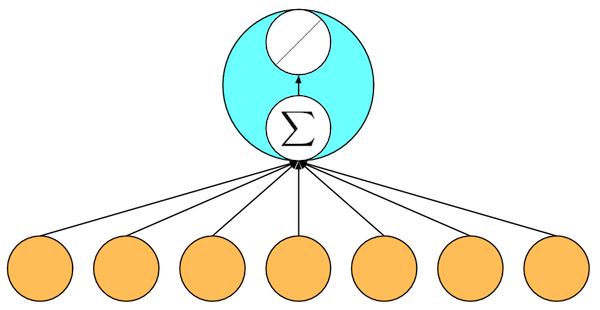

# Neural Network (NN)

**What is a NN?**
A neural network is just a collection of nodes (aka neurons) connected by directed edges. In most networks, we arrange the nodes into layers with each taking input from the nodes below. To calculate the value of any node, we first perform a weighted sum of the inputs (according to weights w) and then apply an activation function. For linear regression, we have two layers, the input (depicted in orange) and a single output node (depicted in green) and the activation function is just the identity function.

In this picture, we visualize all of the components of each input as orange circles.

**Why are NN important?**
They are universal approximation machines, it's to mathmatically handle any type of problem, 
They are an infinitly flexible function, meaning that it can be used to solve any type of problem.

**If a NN can theoretically approximate anything why does model architecture and activations even matter?** TODO:
It would take an impossibly long time to complete a satisfactory calculation.

**What data do you need to train a NN?**
You need data that shows examples of what you want to predict.